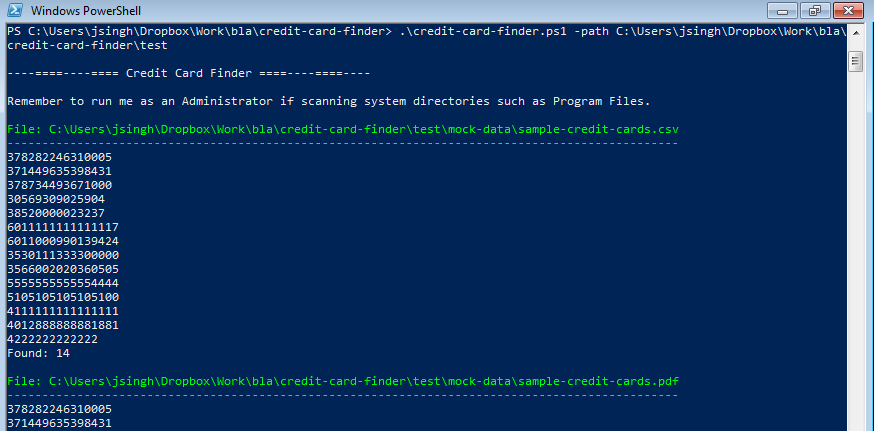

Credit Card Finder
==================

A Powershell script for discovering clear text credit cards on a Windows machine. The script has the following features:

Features
--------

- It searches all files recursively in the provided path
- Credit card numbers are validated using the Luhn algorithm to reduce false positives
- The script can read arbitrarily large files in chunks to minimise its usage of system resources
- File formats tested and supported:
	- Text files
	- PDF documents (text is parsed using the awesome [iTextSharp](http://sourceforge.net/projects/itextsharp/), no OCR is performed)
	- Excel worksheets (requires Excel to be installed on the system)
- File formats expected to be supported in the future:
	- Zipped archives
	- Office documents (warning is thrown when these documents are encountered)

Usage
-----

1. Clone the repository using `git clone https://github.com/jksdua/credit-card-finder`
2. Enter the directory using `cd credit-card-finder`
3. Execute the script using `.\credit-card-finder.ps1 -path C:\Users\user`

> Run the script with Administrator privileges for best results.

Execute the script on the sample files included under the test directory to assess its usage.

Issues
------

This script is currently in alpha stage.

- One known bug is that the script is not very memory efficient. It is not suitable for running on the entire filesystem in its current state.
- It uses `Write-Host` to output colored console output. Unfortunately, this breaks file output using redirection. This is currently being fixed.

Future
------

- It would be great to port this to other platforms such as Linux and OSX.